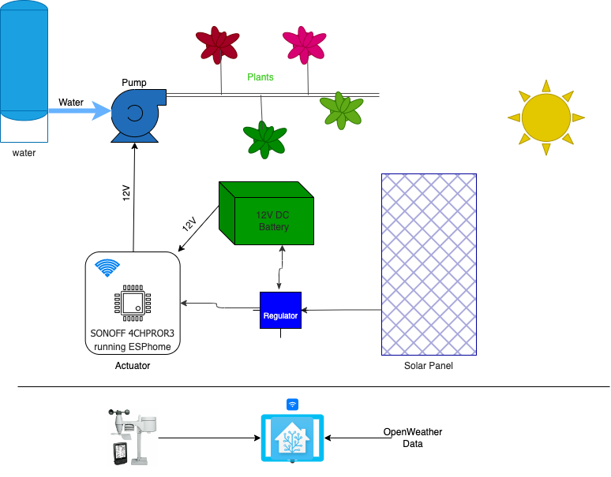

# Home Assistant & Home brewed "Autonomous" irrigation

## FAQ
1. I noticed the title, what do you mean by "Autonomous" ?
	* I happen to live in a apartment with a terrace in town. This terrace has no easy water access, and no electrical powering facility.
2. What does this mean for an irrigation system ?
	* This means:
		* Being able to pump water to plants
		* Being able to store resources: water, power
		* Be scarce on resources: just use what is needed, no waste (if possible)

## Design

### Hardware
1. Water tank: it obviously provides with the irrigation main item: water. Yoohoo ! :+1:.
2. Solar panel: it provides electrical power to activate the pump.
3. Pump: needed to push water to the plant, through pipe and drippers.
4. Switch: provides external input to the pump.

### Software
* Software is at some point needed to drive the switch to start the pump, and stop the pump too.
* I happen to have a [Home Assistant](http://home-assistant.io) instance running in the apartment, connected to wifi.
* Home assistant provides with tons of marvellous addons. This [addon](https://github.com/jeroenterheerdt/HAsmartirrigation) from @jeroenterheerdt is able, provided meteorological data, to calculate evapotranspiration and water volume to provide to plants for them to get enough water. This means, that depending on the temperatures, the rain of the day, wind, ... the netto evapotranspiration is assessed and the water quantities to provide are calculated.

### Big picture

